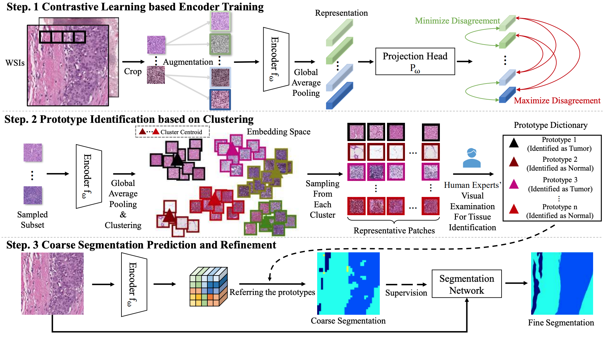

# [IPMI2023]Human-machine Interactive Tissue Prototype Learning for Label-efficient Histopathology Image Segmentation
## Introduction
This repository is an official implementation of the IPMI 2023 paper [Human-machine Interactive Tissue Prototype Learning for Label-efficient Histopathology Image Segmentation](https://arxiv.org/abs/2211.14491).


## Datasets
[CAMELYON16](https://camelyon16.grand-challenge.org/Data/)

[Breast Cancer Semantic Segmentation (BCSS)](https://bcsegmentation.grand-challenge.org/)


## Dependencies
```
conda create -n Proto2Seg python=3.8
conda activate Proto2Seg
pip install -r requirements.txt
```
## Contrastive Learning based Encoder Training
### Training
```
cd ./contrastive_pretrain
python train.py --config [path/to/config]
```
## Prototype Identification based on Clustering
```
cd ./prototype_dict_building_and_coarse_segmentation
python cluster.py --config  [path/to/config]
```

## Coarse Segmentation Prediction
```
cd ./prototype_dict_building_and_coarse_segmentation
python coarse_seg_cluster_query.py --config  [path/to/config] --n 5
```

## Refinement
### Training

```
cd ./refinement
python -m torch.distributed.launch --nproc_per_node 8 train_seg.py --config [path/to/config]
```

### Inference

```
cd ./refinement
python test.py --dir [path/to/log] --dataset-name [dataset]
```

## Citation
```
@article{pan2022human,
  title={Human-machine Interactive Tissue Prototype Learning for Label-efficient Histopathology Image Segmentation},
  author={Pan, Wentao and Yan, Jiangpeng and Chen, Hanbo and Yang, Jiawei and Xu, Zhe and Li, Xiu and Yao, Jianhua},
  booktitle={Information Processing In Medical Imaging},
  year={2023}
}
```